<!-- One continuous poster: pre-rendered SVG slices of a single scene, drawn by
     generate.py from real data and regenerated nightly by forest.yml.
     Architecture after jdx/jdx. The forest art is original. -->

<picture><source media="(prefers-color-scheme: dark)" srcset="assets/header-dark.svg"></picture>
<picture><source media="(prefers-color-scheme: dark)" srcset="assets/link-site.svg"></picture><a href="https://www.youtube.com/@LuixBits"><picture><source media="(prefers-color-scheme: dark)" srcset="assets/link-youtube.svg"></picture></a><a href="https://www.doctorswithoutborders.org/"><picture><source media="(prefers-color-scheme: dark)" srcset="assets/link-sponsor.svg"></picture></a><a href="mailto:contact@luizperren.dev"><picture><source media="(prefers-color-scheme: dark)" srcset="assets/link-contact.svg"></picture></a>
<a href="https://github.com/LuixBits/luix_nix_config"><picture><source media="(prefers-color-scheme: dark)" srcset="assets/ridge-1.svg"></picture></a>
<a href="https://github.com/LuixBits/luixbits-roomplanner.nvim"><picture><source media="(prefers-color-scheme: dark)" srcset="assets/ridge-2.svg"></picture></a>
<a href="https://github.com/LuixBits/TextSight"><picture><source media="(prefers-color-scheme: dark)" srcset="assets/ridge-3.svg"></picture></a>
<a href="https://github.com/LuixBits/luixbits-noctalia-plugins"><picture><source media="(prefers-color-scheme: dark)" srcset="assets/ridge-4.svg"></picture></a>
<picture><source media="(prefers-color-scheme: dark)" srcset="assets/range.svg"></picture>
<picture><source media="(prefers-color-scheme: dark)" srcset="assets/contribution-forest.svg"></picture>
<picture><source media="(prefers-color-scheme: dark)" srcset="assets/languages.svg"></picture>
<a href="https://www.youtube.com/watch?v=uxa2oeUaEXU"><picture><source media="(prefers-color-scheme: dark)" srcset="assets/videos-1.svg"></picture></a>
<a href="https://www.youtube.com/watch?v=4DwON-i-bdI"><picture><source media="(prefers-color-scheme: dark)" srcset="assets/videos-2.svg"></picture></a>
<a href="https://www.youtube.com/watch?v=sLgWPGDrI7Y"><picture><source media="(prefers-color-scheme: dark)" srcset="assets/videos-3.svg"></picture></a>
<picture><source media="(prefers-color-scheme: dark)" srcset="assets/campfire.svg"></picture>

more stats

 

  
  

