<picture><source media="(prefers-color-scheme: dark)" srcset="assets/header-dark.svg"></picture>

<a href="https://luizperren.dev"><picture><source media="(prefers-color-scheme: dark)" srcset="assets/link-site.svg"></picture></a><a href="https://www.youtube.com/@LuixBits"><picture><source media="(prefers-color-scheme: dark)" srcset="assets/link-youtube.svg"></picture></a><a href="https://www.doctorswithoutborders.org/"><picture><source media="(prefers-color-scheme: dark)" srcset="assets/link-sponsor.svg"></picture></a><a href="mailto:contact@luizperren.dev"><picture><source media="(prefers-color-scheme: dark)" srcset="assets/link-contact.svg"></picture></a>

<picture><source media="(prefers-color-scheme: dark)" srcset="assets/trail-head.svg"></picture>
<a href="https://github.com/LuixBits/luix_nix_config"><picture><source media="(prefers-color-scheme: dark)" srcset="assets/trail-wp1.svg"></picture></a>
<a href="https://github.com/LuixBits/luixbits-roomplanner.nvim"><picture><source media="(prefers-color-scheme: dark)" srcset="assets/trail-wp2.svg"></picture></a>
<a href="https://github.com/LuixBits/TextSight"><picture><source media="(prefers-color-scheme: dark)" srcset="assets/trail-wp3.svg"></picture></a>
<a href="https://github.com/LuixBits/luixbits-noctalia-plugins"><picture><source media="(prefers-color-scheme: dark)" srcset="assets/trail-wp4.svg"></picture></a>
<picture><source media="(prefers-color-scheme: dark)" srcset="assets/trail-legend.svg"></picture>

<picture><source media="(prefers-color-scheme: dark)" srcset="assets/contribution-forest.svg"></picture>
<picture><source media="(prefers-color-scheme: dark)" srcset="assets/lang-rings.svg"></picture>
<picture><source media="(prefers-color-scheme: dark)" srcset="assets/campfire.svg"></picture>

more stats

 

  
  

Regenerated nightly by <a href=".github/workflows/forest.yml">forest.yml</a> from real data, drawn by <a href="generate.py">generate.py</a>. Architecture after <a href="https://github.com/jdx/jdx">jdx/jdx</a>, whose console design is <a href="https://dev.to/georgekobaidze/i-turned-my-github-profile-into-a-cyberpunk-console-with-a-city-built-from-my-contributions-h4c">Giorgi Kobaidze's</a> (MIT). The forest is original.

