<!-- Pre-rendered SVG profile, drawn by generate.py from real data and
     regenerated nightly by .github/workflows/forest.yml.
     Architecture after jdx/jdx. The forest art is original. -->
<picture><source media="(prefers-color-scheme: dark)" srcset="assets/header-dark.svg"></picture>

<picture><source media="(prefers-color-scheme: dark)" srcset="assets/link-site.svg"></picture><a href="https://www.youtube.com/@LuixBits"><picture><source media="(prefers-color-scheme: dark)" srcset="assets/link-youtube.svg"></picture></a><a href="https://www.doctorswithoutborders.org/"><picture><source media="(prefers-color-scheme: dark)" srcset="assets/link-sponsor.svg"></picture></a><a href="mailto:contact@luizperren.dev"><picture><source media="(prefers-color-scheme: dark)" srcset="assets/link-contact.svg"></picture></a>

<a href="https://github.com/LuixBits/luix_nix_config"><picture><source media="(prefers-color-scheme: dark)" srcset="assets/wheel-q1.svg"></picture></a><a href="https://github.com/LuixBits/luixbits-roomplanner.nvim"><picture><source media="(prefers-color-scheme: dark)" srcset="assets/wheel-q2.svg"></picture></a>
<a href="https://github.com/LuixBits/TextSight"><picture><source media="(prefers-color-scheme: dark)" srcset="assets/wheel-q3.svg"></picture></a><a href="https://github.com/LuixBits/luixbits-noctalia-plugins"><picture><source media="(prefers-color-scheme: dark)" srcset="assets/wheel-q4.svg"></picture></a>

<picture><source media="(prefers-color-scheme: dark)" srcset="assets/contribution-forest.svg"></picture>
<picture><source media="(prefers-color-scheme: dark)" srcset="assets/languages.svg"></picture>
<picture><source media="(prefers-color-scheme: dark)" srcset="assets/campfire.svg"></picture>

more stats

 

  
  

